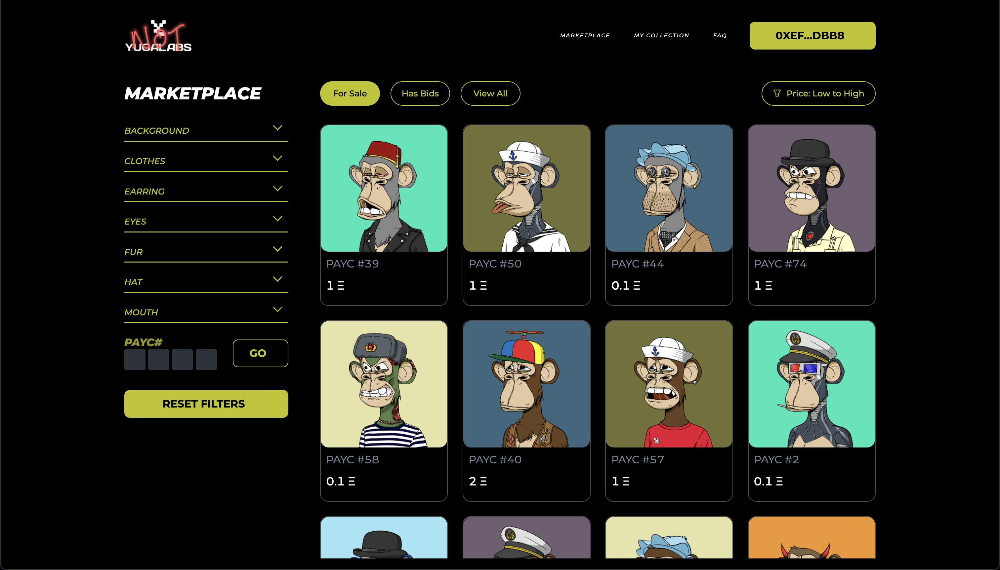

# `PAYC Marketplace`

An open source marketplace built by the phunky ape community. We have built this to fulfill our desire to help other NFT projects who have also been DMCA'd. The power of open protocols represents a shift for the common individual to take control and to transact freely.



# ⭐️ `Star us`

If you like to get phunky, please star us :) 

# 🚀 Quick Start

📄 Clone or fork `payc-marketplace`:

```sh
git clone https://github.com/Phunky-Ape-Yacht-Club/phunky-mp.git
```

💿 Install all dependencies:

```sh
cd payc-marketplace
yarn install
```

Note: 
Images have been ommitted from git tracking to avoid bloat. Populate public/ipfs with the collection's images (0.png, 1.png, 2.png). 


🚴‍♂️ Run your App:

```sh
yarn start
```
